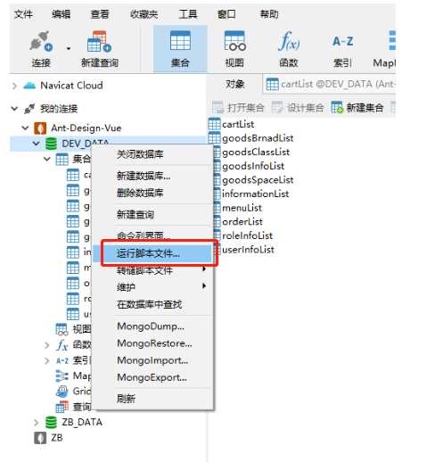
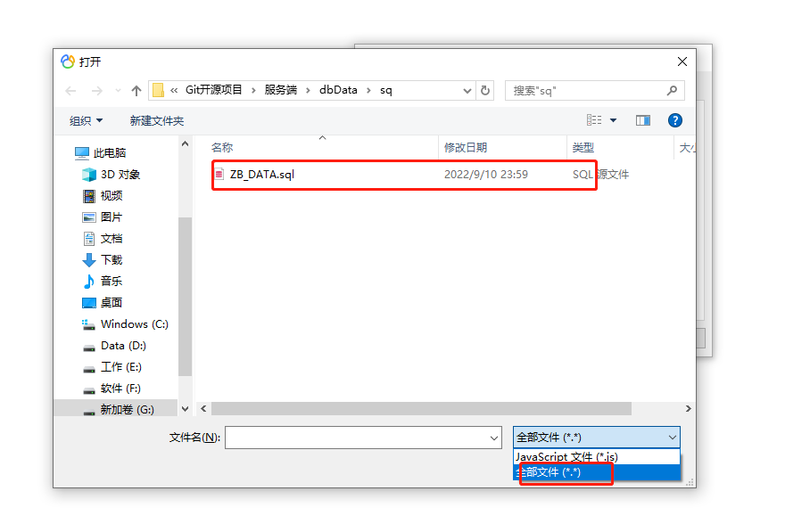
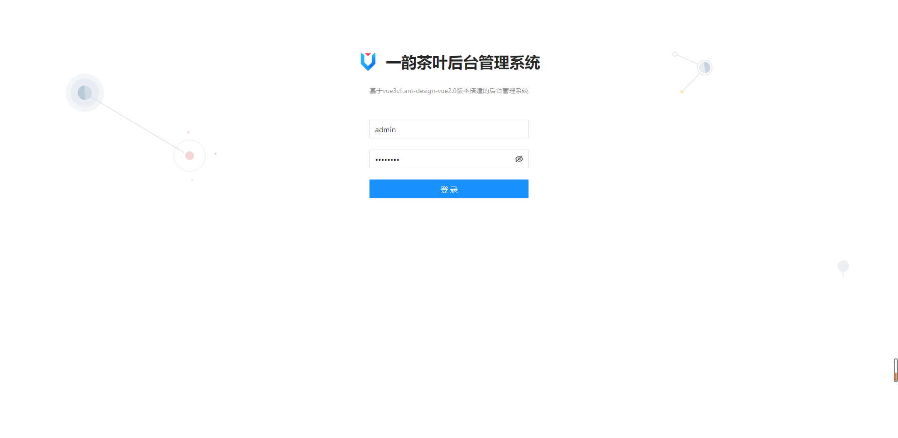
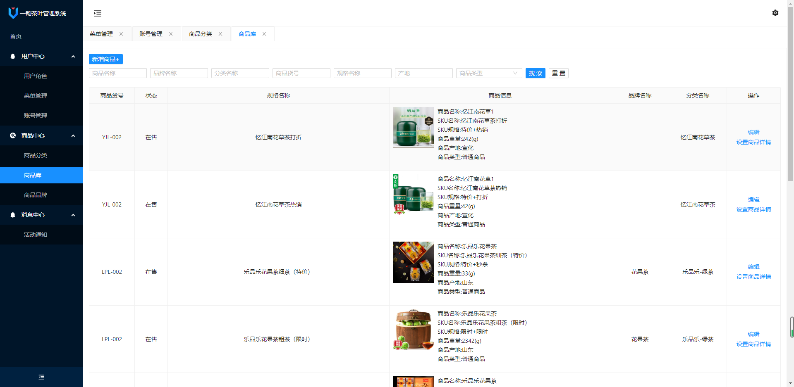
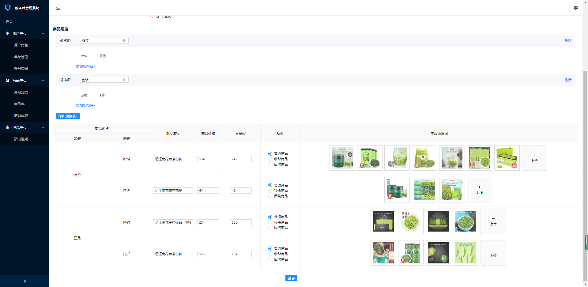
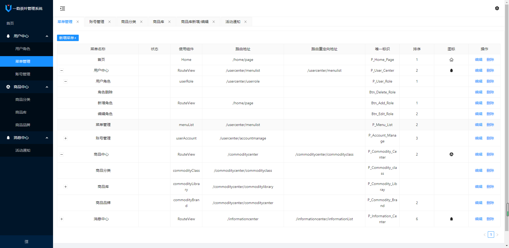

# Express+Vue3+AntDesign3

#### 介绍
后端：node.js +mongoose +express
前端：vue3+ant-design-vue3

#### 软件架构
软件架构说明

#### 安装教程 后端

##### 1.  npm i
##### 2.  npm start
##### 3. 将请求接口换成控制台输出地址

##### 4.

##### 5. 数据导入:建议使用dbData下js文件js脚本导入或者sq文件下sq导入（json格式导入数据格式会改变）
##### 6. 以Navicat为例找到要导入的数据库右击选择 “运行脚本文件” 选择对应的文件 如下图：

#### 安装教程 前端

##### 1.  yarn
##### 2.  yarn serve

##### 3.前端界面

##### 6.小程序端预览端

